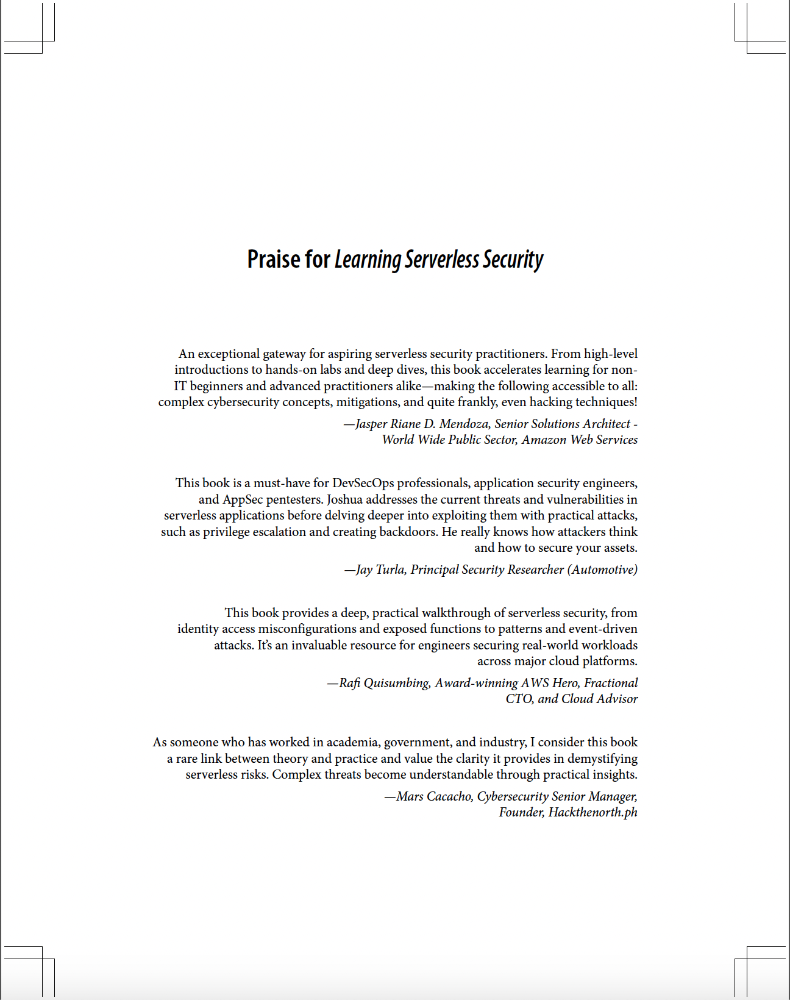
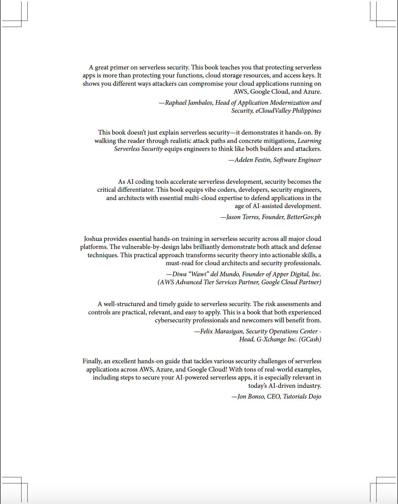
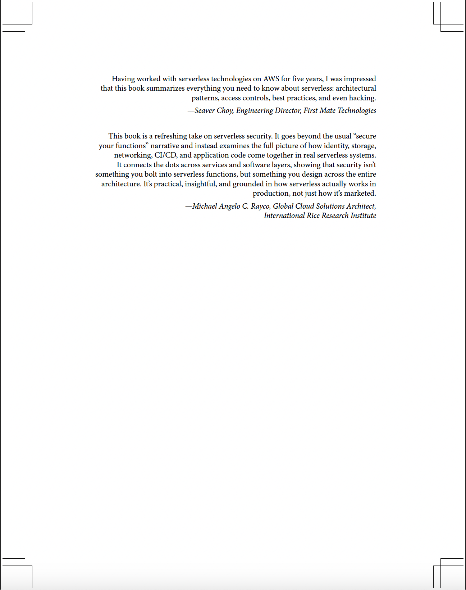

# Learning Serverless Security

This is the official GitHub account for the book *Learning Serverless Security*, published by O'Reilly Media. It contains the [repositories](https://github.com/learning-serverless-security?tab=repositories) and [gists](https://gist.github.com/learning-serverless-security) referenced throughout the [book](https://www.oreilly.com/library/view/learning-serverless-security/9781098149000/).

This book is for security engineers, cloud engineers, developers, security architects, and penetration testers responsible for managing, auditing, and securing their cloud infrastructure. This book is targeted toward professionals with experience using cloud services who are planning to dive deeper into cloud and serverless security. You are expected to have a good understanding of the concepts of cloud computing and security. Basic knowledge of serverless computing and the fundamental services of AWS, Google Cloud, and Azure will help. Knowledge or experience using security tools is optional.

Despite the increased adoption of serverless computing, relatively few books and resources focus on the security of serverless applications and systems. With the opportunity to influence the future of technology, I decided to write this book to help the next generation of technology professionals build more-secure applications in the cloud. I hope that this book will be a useful resource for those interested in learning
more about serverless security strategies and best practices.

## What Readers Are Saying About This Book

  
  
  

## Chapter 1: Introduction to Serverless Computing

In this chapter, you will learn what serverless is, along with other key concepts relevant to serverless architectures. You will explore scenarios where serverless makes the most sense and examine and debunk various myths and misconceptions associated with serverless computing. Toward the end of this introductory chapter, you will also discover that serverless applications are not immune to security threats and risks.

**Chapter Resources**:

- **Link**: [Lambda Pricing Page](https://aws.amazon.com/lambda/pricing/)

## Chapter 2: Understanding Serverless Architectures and Implementation Patterns

In this chapter, you will explore various cloud services and capabilities that enable the serverless operational model. You will dive deep into some of the most common building blocks, patterns, and solutions used in serverless architectures and review the relevant security considerations along the way.

**Chapter Resources**:

- **Link**: [Bringing serverless to Azure Kubernetes Service](https://azure.microsoft.com/en-us/blog/bringing-serverless-to-azure-kubernetes-service/)
- **Link**: [Export data from Cloud SQL without performance overhead](https://cloud.google.com/blog/products/databases/introducing-cloud-sql-serverless-exports)
- **Link**: [Serverless on AWS](https://aws.amazon.com/serverless/)
- **Link**: [Serverless on Azure](https://azure.microsoft.com/en-us/solutions/serverless)
- **Link**: [Cloud Functions is now Cloud Run functions](https://cloud.google.com/blog/products/serverless/google-cloud-functions-is-now-cloud-run-functions)
- **Link**: [Serverless for Apache Spark overview](https://docs.cloud.google.com/dataproc-serverless/docs/overview#s8s-compared)
- **Link**: [Go Serverless](https://cloud.google.com/solutions/serverless?hl=en)
- **Link**: [Deploy models with Amazon SageMaker Serverless Inference - Container Support](https://docs.aws.amazon.com/sagemaker/latest/dg/serverless-endpoints.html#serverless-endpoints-how-it-works-containers)
- **Link**: [Run your AI inference applications on Cloud Run with NVIDIA GPUs](https://cloud.google.com/blog/products/application-development/run-your-ai-inference-applications-on-cloud-run-with-nvidia-gpus)
- **Link**: [Run Hugging Face transformers on GPU enabled Cloud Run functions](https://www.youtube.com/watch?v=nicwHD7M8l8)
- **Link**: [Create a Lambda function using a container image](https://docs.aws.amazon.com/lambda/latest/dg/images-create.html)
- **Link**: [Create your first containerized Azure Functions](https://learn.microsoft.com/en-us/azure/azure-functions/functions-deploy-container)
- **Link**: [Serverless Patterns Collection](https://serverlessland.com/patterns?services=apigw)

## Chapter 3: Diving Deeper into Serverless Security Threats and Risks

In this chapter, you’ll dive deeper into serverless security threats and risks and examine how these could lead to breaches and incidents. You will learn how attackers adapt their techniques to serverless implementation patterns and exploit vulnerabilities and misconfigurations in the building blocks and services used within serverless architectures.

**Chapter Resources**:

- **Link**: [OWASP Serverless Top 10](https://owasp.org/www-project-serverless-top-10/)
- **Link**: [OWASP Top 10 API Security Risks – 2023](https://owasp.org/API-Security/editions/2023/en/0x11-t10/)
- **Link**: [Account Takeover and Malicious Replacement of ctx Project](https://python-security.readthedocs.io/pypi-vuln/index-2022-05-24-ctx-domain-takeover.html)
- **Link**: [Malware in pre-build binaries of bignum](https://github.com/advisories/GHSA-7cgc-fjv4-52x6)

## Chapter 4: Exploiting and Securing Exposed AWS IAM Credentials

In this chapter, you will examine how attackers can exploit exposed IAM credentials in serverless applications. You will dive deep into how credentials in client-side code can be abused to gain full administrative access to an AWS account, how overly permissive IAM policies can be leveraged to disable AWS CloudTrail logging, and how backdoor IAM users can be created with just a few commands. Toward the end of the chapter, you will learn how to audit CloudTrail event data and Bedrock model invocation logs to investigate security incidents and understand how attacks unfold in a serverless application.

**Chapter Resources**: 

- **Gist**: [Chapter code & commands](https://gist.github.com/learning-serverless-security/0473eb5e8ca1017c0b95935ad70a46e6)
- **Github Repository**: [exposed-credentials-chat-example](https://github.com/learning-serverless-security/exposed-credentials-chat-example)
- **Link**: [AWS Free Tier](https://aws.amazon.com/free/)
- **Link**: [Access Amazon Bedrock foundation models](https://docs.aws.amazon.com/bedrock/latest/userguide/model-access.html)
- **Link**: [AWS re:Inforce 2023 - A first-principles approach: AWS Identity and Access Management (IAM) (IAM201)](https://www.youtube.com/watch?v=z-tbVVojMp0)
- **Link**: [AWS Customer Support Policy for Penetration Testing](https://aws.amazon.com/security/penetration-testing/)
- **Link**: [DDoS Simulation Testing Policy](https://aws.amazon.com/security/ddos-simulation-testing/)
- **Link**: [AWS Management Console](console.aws.amazon.com/console/home)
- **Link**: [scanning-for-hardcoded-secrets.md](https://gist.github.com/learning-serverless-security/1b5eb88410c46d6158456e3de598856d)
- **Link**: [Locking objects with Object Lock](https://docs.aws.amazon.com/AmazonS3/latest/userguide/object-lock.html)
- **Link**: [start-logging](https://docs.aws.amazon.com/cli/latest/reference/cloudtrail/start-logging.html)
- **Link**: [Set an account password policy for IAM users](https://docs.aws.amazon.com/IAM/latest/UserGuide/id_credentials_passwords_account-policy.html)
- **Gist**: [input.json](https://gist.github.com/learning-serverless-security/2d70784751dedaf23cd7d8e220291b4a)
- **Gist**: [auditing-logs.md](https://gist.github.com/learning-serverless-security/77a403d2f19182f818ed781778599de2)

## Chapter 5: Exploiting and Securing Misconfigured AWS IAM Roles

In this chapter, you'll explore how attackers can perform privilege escalation by using misconfigured AWS IAM roles. You'll also see how they might establish persistence by deploying a backdoored version of a Lambda function to regain access even after credentials are rotated or revoked.

**Chapter Resources**: 

- **Gist**: [Chapter code & commands](https://gist.github.com/learning-serverless-security/b17727f3b7a61ea2375a54efc99b1f86)
- **Link**: [AWS Management Console](console.aws.amazon.com/console/home)
- **Gist**: [lambda_function.py](https://gist.github.com/learning-serverless-security/ea63ad2fd85669155d79a17c5c55f6c5)

## Chapter 6: Hacking Publicly Accessible AWS Lambda Functions

In this chapter, you will take a closer look at how attackers can exploit publicly exposed vulnerable Lambda functions. You'll experience the attacker’s perspective firsthand and execute arbitrary code to retrieve the source code of the compromised Lambda function, as well as exfiltrate credentials from within the serverless application. This will help you recognize security issues and misconfigurations before they can be exploited.

**Chapter Resources**: 

- **Gist**: [Chapter code & commands](https://gist.github.com/learning-serverless-security/219fae2eb40b4c55bbf657eda7af100b)
- **GitHub Repository**: [vulnerable-lambda-function-backend](https://github.com/learning-serverless-security/vulnerable-lambda-function-backend)
- **GitHub Repository**: [vulnerable-lambda-function-frontend](https://github.com/learning-serverless-security/vulnerable-lambda-function-frontend)
- **GitHub Repository**: [request-receiver](https://github.com/learning-serverless-security/request-receiver)
- **Link**: [AWS Management Console](console.aws.amazon.com/console/home)
- **Link**: 
- **Link**: 
- **Link**: 
- **Link**: 
- **Link**: 

## Chapter 7: Running and Securing Serverless Functions in a VPC

In this chapter, you'll build on what you've learned and configure the Lambda function with a VPC with restrictive outbound access. You will also refactor the function code to eliminate the use of eval() to secure it against code injection attacks. As you dive deeper into the next chapter, you'll learn which security controls are effective and which ones fall short against the types of attacks leveraged by attackers in serverless applications.

**Chapter Resources**: 
- **Gist**: [Chapter code & commands](https://gist.github.com/learning-serverless-security/b64e27b3ae3b45fbad9684f50218c36d)
- **Link**: 
- **Link**: 
- **Link**: 
- **Link**: 
- **Link**: 
- **Link**: 

## Chapter 8: Hacking and Securing Google Cloud Storage Buckets

In this chapter, you will shift your focus to Google Cloud and explore how attackers can exploit cloud storage bucket misconfigurations to expose or steal sensitive data. You will simulate scenarios such as dangling bucket takeovers and examine how lingering references to deleted buckets can be abused for malicious purposes. Finally, you will learn how to enforce secure bucket configurations by using IaC to minimize the risk of costly misconfigurations.

**Chapter Resources**: 

- **Gist**: [Chapter code & commands](https://gist.github.com/learning-serverless-security/8d68b9283896610f573fc38022da6cdc)
- **GitHub Repository**: [misconfigured-cloud-storage-bucket](https://github.com/learning-serverless-security/misconfigured-cloud-storage-bucket)
- **GitHub Repository**: [bucket_iac](https://github.com/learning-serverless-security/bucket_iac)
- **Link**: 
- **Link**: 
- **Link**: 
- **Link**: 
- **Link**: 
- **Link**: 

## Chapter 9: Abusing Google Cloud Storage Event Triggers with Malicious File Uploads

In this chapter, you’ll dive deeper into how attackers exploit misconfigurations and code injection vulnerabilities in event-driven file-processing applications in Google Cloud. You’ll also examine what works and what doesn’t when securing event-driven file-processing workflows from attackers.

**Chapter Resources**: 

- **Gist**: [Chapter code & commands](https://gist.github.com/learning-serverless-security/488fee2baadda2c37c72db84004669bf)
- **GitHub Repository**: [cloud-run-html-to-pdf](https://github.com/learning-serverless-security/cloud-run-html-to-pdf)
- **Link**: 
- **Link**: 
- **Link**: 
- **Link**: 
- **Link**: 
- **Link**: 

## Chapter 10: Setting up Backdoors and Escalating Privileges in Google Cloud

In this chapter, you will build on what you’ve learned by exploring how an attacker could exploit a vulnerable Cloud Run service, bypass restrictions, and set up a backdoor without relying on a reverse shell. You will also simulate privilege escalation in Google Cloud by abusing overly permissive service accounts tied to serverless compute resources.

**Chapter Resources**: 
- **Gist**: [Chapter code & commands](https://gist.github.com/learning-serverless-security/f3be4ec4e33abae6053f69f3ae41b126)
- **Link**: 
- **Link**: 
- **Link**: 
- **Link**: 
- **Link**: 
- **Link**: 

## Chapter 11: Hacking and Securing Azure Functions

In this chapter, you’ll shift your focus to Microsoft Azure and examine how attackers can exploit vulnerable Azure Functions. As you go through the simulations and hands-on examples, you’ll learn how to recognize various types of misconfigurations and secure them against potential threats.

**Chapter Resources**: 
- **Gist**: [Chapter code & commands](https://gist.github.com/learning-serverless-security/7b55190a065e175a9cf8f4df0d2ca88c)
- **Link**: 
- **Link**: 
- **Link**: 
- **Link**: 
- **Link**: 
- **Link**: 

## Chapter 12: Escalating Privileges in Microsoft Azure

In this chapter, you will dive deep into privilege escalation in Azure by examining how an overly permissive managed identity tied to the vulnerable function app can be abused. You’ll simulate extracting the function app’s managed-identity access token, then use that token to escalate to Owner-level privileges and read secrets from Azure Key Vault.

**Chapter Resources**: 
- **Gist**: [Chapter code & commands](https://gist.github.com/learning-serverless-security/f1db55c6a67c2a69790f0df9ebab0412)
- **Link**: 
- **Link**: 
- **Link**: 
- **Link**: 
- **Link**: 
- **Link**: 

## Chapter 13: Analyzing, Auditing, and Securing Serverless Application Code

In this chapter, you will explore additional techniques and best practices to secure your serverless applications. You’ll learn how to leverage automated tools, secure coding practices, and custom scripts to further secure your applications against code injection, supply chain attacks, and other emerging threats.

**Chapter Resources**: 
- **Gist**: [Chapter code & commands](https://gist.github.com/learning-serverless-security/ba892f00ce67dd5748af7f5c3ef1ace8)
- **Link**: 
- **Link**: 
- **Link**: 
- **Link**: 
- **Link**: 
- **Link**: 

## Acknowledgments

Writing this book has been a truly rewarding experience, thanks to the unwavering support and invaluable feedback shared by many dedicated contributors.

I would like to express my deepest gratitude to the reviewers who generously shared their time, expertise, and valuable input throughout the development of this book. Thank you to Adelen Festin, Raphael Jambalos, Sathiesh Veera, Anil Moka, and Wietse Venema. Your insightful comments and actionable feedback have been invaluable. 

Special thanks to the O’Reilly team, including Simina Calin, Rita Fernando, Sara Hunter, Beth Kelly, Gregory Hyman, and Sharon Wilkey for your guidance, support, and attention to detail throughout the publishing process. Many others also played important roles in bringing this book to life, and I am truly grateful for their contributions.

Thank you for being part of this journey and helping shape this book into what it is today.

## Get to Know the Author

**Joshua Arvin Lat** is the Chief Technology Officer (CTO) of NuWorks Interactive Labs, Inc. He previously served as the CTO of three Australian-owned companies and as the Director for Software Development and Engineering for multiple ecommerce start-ups. Years ago, he and his team won first place in a global cybersecurity competition with their published research paper. 

He is an AWS AI Hero and has authored several other technical books including Machine Learning with Amazon SageMaker Cookbook, Machine Learning Engineering on AWS, and Building and Automating Penetration Testing Labs in the Cloud. Because of his proven track record in leading digital transformation within organizations, he has been recognized as one of the prestigious Orange Boomerang: Digital Leader of the Year 2023 award winners.

## Other books by the author

