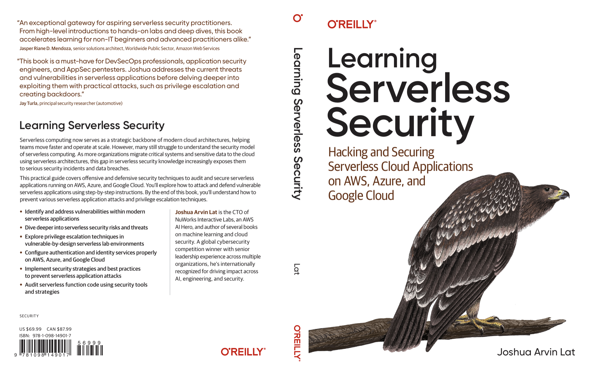

# Learning Serverless Security

This is the code repository for the book *Learning Serverless Security*, published by O'Reilly.

## Chapter 1: Introduction to Serverless Computing

## Chapter 2: Understanding Serverless Architectures and Implementation Patterns

## Chapter 3: Diving Deeper into Serverless Security Threats and Risks

## Chapter 4: Exploiting and Securing Exposed AWS IAM Credentials

## Chapter 5: Exploiting and Securing Misconfigured AWS IAM Roles

## Chapter 6: Hacking Publicly Accessible AWS Lambda Functions

## Chapter 7: Running and Securing Serverless Functions in a VPC

## Chapter 8: Hacking and Securing Google Cloud Storage Buckets

## Chapter 9: Abusing Google Cloud Storage Event Triggers with Malicious File Uploads

## Chapter 10: Setting up Backdoors and Escalating Privileges in Google Cloud

## Chapter 11: Hacking and Securing Azure Functions

## Chapter 12: Escalating Privileges in Microsoft Azure

## Chapter 13: Analyzing, Auditing, and Securing Serverless Application Code

## Get to Know the Author

**Joshua Arvin Lat** is the Chief Technology Officer (CTO) of NuWorks Interactive Labs, Inc. He previously served as the CTO of three Australian-owned companies and as the Director for Software Development and Engineering for multiple ecommerce start-ups. Years ago, he and his team won first place in a global cybersecurity competition with their published research paper. He is an AWS AI Hero and has authored several other technical books including Machine Learning with Amazon SageMaker Cookbook, Machine Learning Engineering on AWS, and Building and Automating Penetration Testing Labs in the Cloud. Because of his proven track record in leading digital transformation within organizations, he has been recognized as one of the prestigious Orange Boomerang: Digital Leader of the Year 2023 award winners.

## Other books by the author

* [Machine Learning Engineering on AWS](https://www.packtpub.com/product/machine-learning-engineering-on-aws/9781803247595)

* [Machine Learning with Amazon SageMaker Cookbook](https://www.packtpub.com/product/machine-learning-with-amazon-sagemaker-cookbook/9781800567030)
  
* [Building and Automating Penetration Testing Labs in the Cloud](https://www.packtpub.com/product/building-and-automating-penetration-testing-labs-in-the-cloud/9781837632398)
